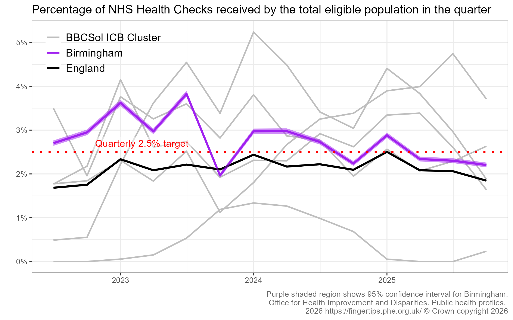
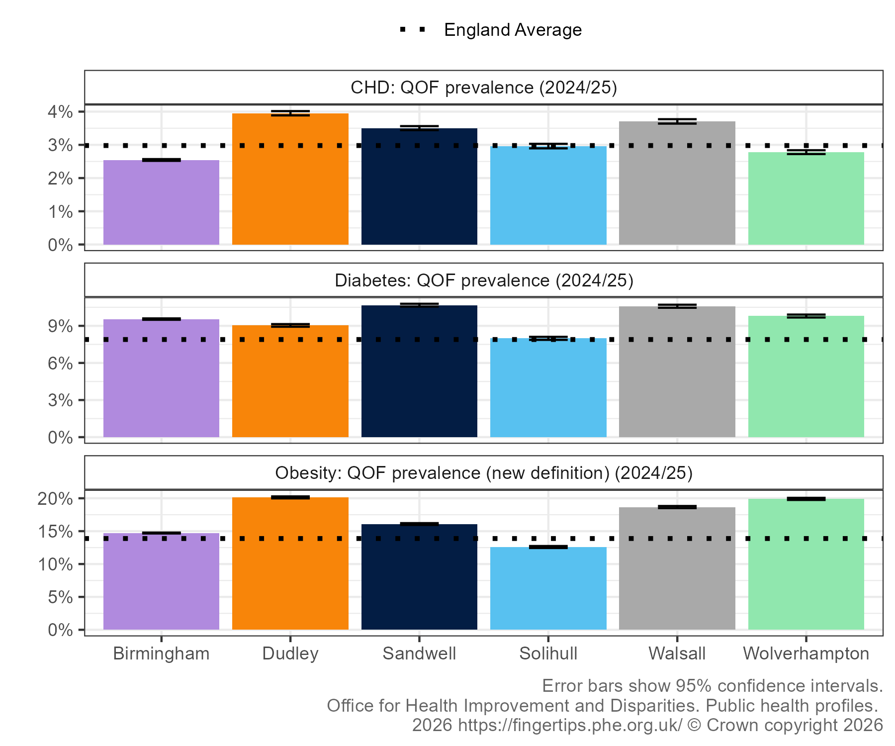

# BBCSol Health Checks

Visualising FingerTips data on uptake and need for NHS Health Checks across local authorities within the Birmingham, Black Country, and Solihull ICB cluster. Data is extracted directly using the FingerTips API for increased reproducibility.

### Health Checks

### Related Conditions

### License

This repository is dual licensed under the Open Government v3 & MIT. All code can outputs are subject to Crown Copyright.

